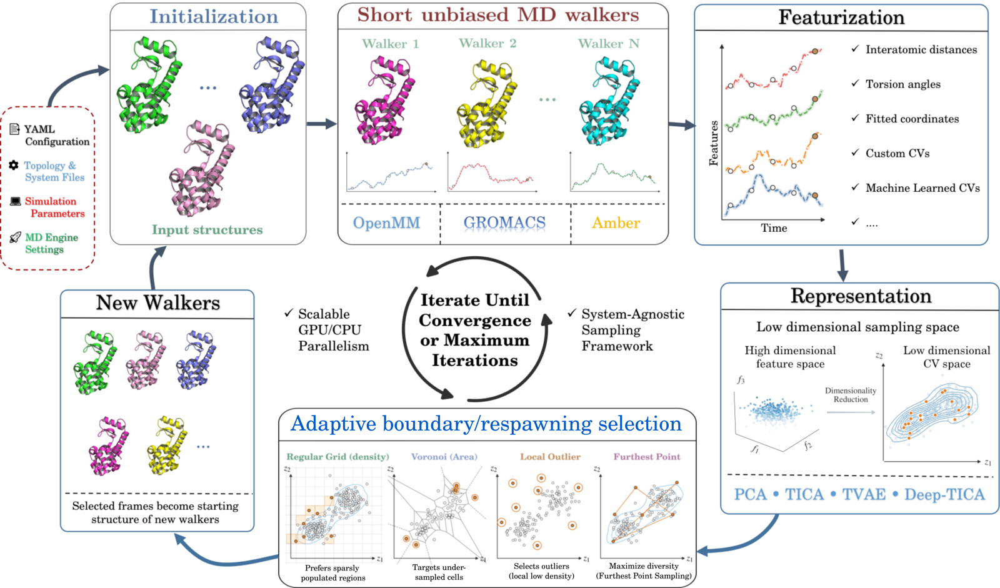
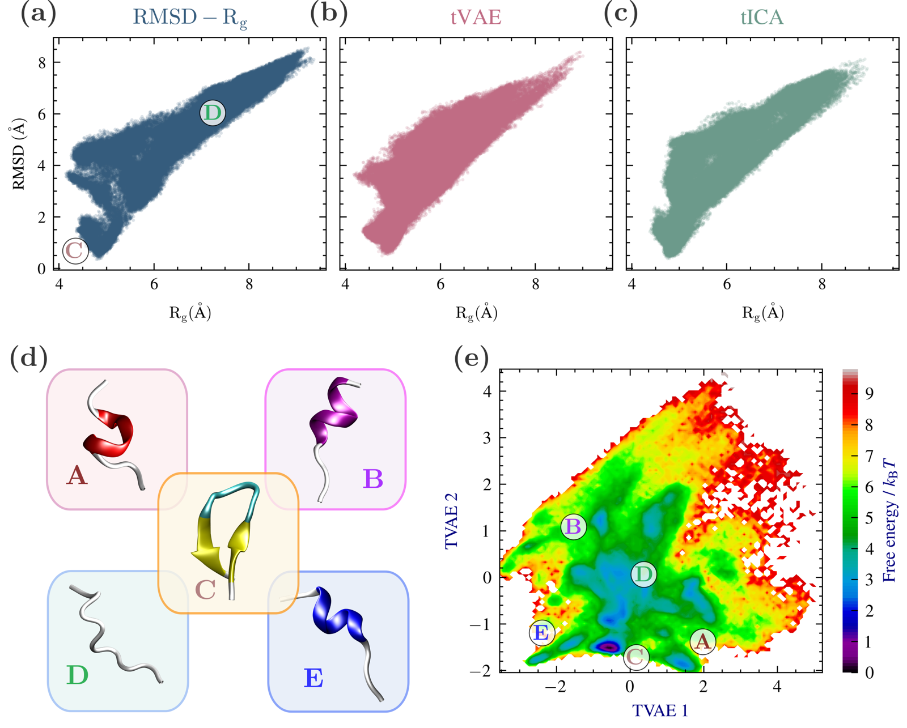
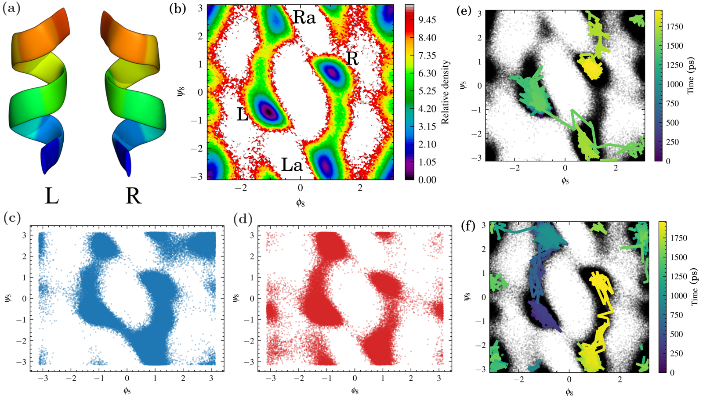
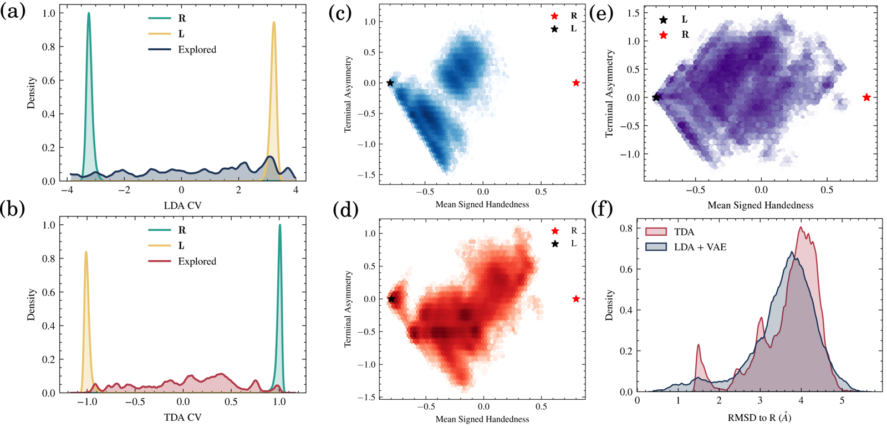
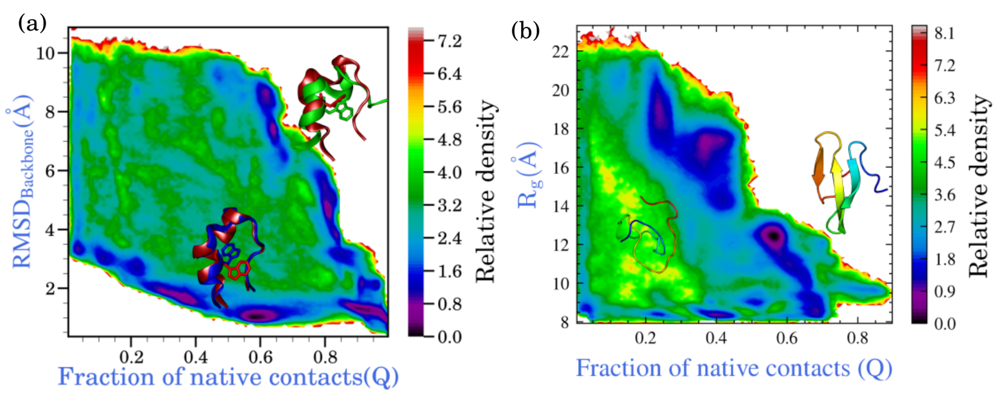
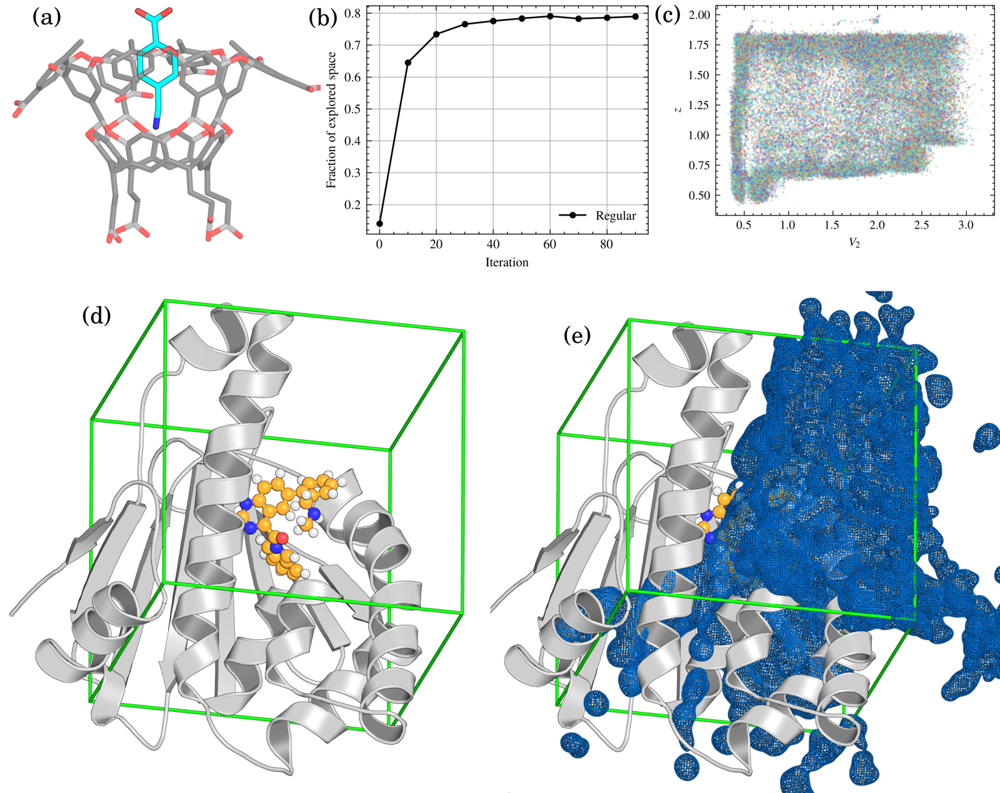
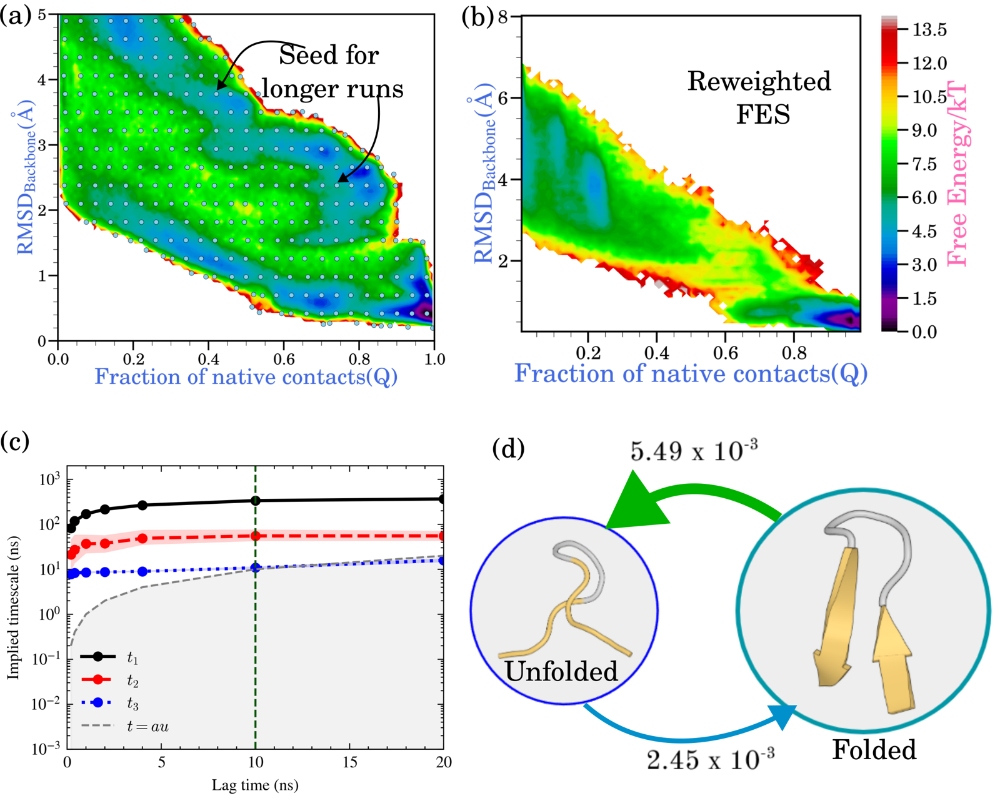

# Results in the paper

The Trails-MD paper demonstrates the framework on several systems beyond the
two runnable examples shipped in this repository (`examples/AlaD/`,
`examples/AIB9/`). This page summarizes those results; the underlying
configurations are not included in the repository, so these are
**illustrative, not reproducible tutorials**. For runnable, step-by-step
examples, see the [Alanine dipeptide](tutorials/alad.md) and
[AIB9](tutorials/aib9.md) tutorials.

## Workflow overview

A YAML configuration defines the molecular system, MD engine, sampling
space, spawning rule, and checkpointing options. Each iteration launches
short unbiased walkers with OpenMM, GROMACS, or Amber, extracts features
from the resulting frames, projects them into a fixed or learned CV space,
and selects new starting frames with a density, Voronoi, local-outlier, or
farthest-point spawner. Selected frames become the starting structures for
the next batch of walkers, and the cycle repeats until convergence or a
maximum iteration count.

## CLN025 (chignolin) folding

Chignolin (CLN025) is a 10-residue peptide that folds into a stable
β-hairpin, but — unlike alanine dipeptide — its folding is not naturally
described by a single well-established low-dimensional coordinate. The
paper compares three sampling spaces for CLN025: fixed physical CVs (Cα
radius of gyration and Cα RMSD from the folded reference), and two learned
2D spaces built from Cα pairwise distances, TVAE and TICA.

Conformations that overlap in the physical Rg–RMSD projection are more
clearly separated in the learned TVAE space, illustrating the value of
adaptive coordinate learning when an informative low-dimensional CV isn't
known in advance.

## AIB9: basin discovery is not a transition pathway

The AIB9 peptide makes a methodological point central to Trails-MD's
design: the goal isn't only to visit the left- (L) and right-handed (R)
helical basins, but to determine whether the sampled trajectories actually
*connect* them.

Several coordinate choices — fixed torsional angles, supervised
LDA/TDA-based coordinates, and unsupervised PCA/TICA/TVAE spaces — all
discovered both L and R basins, sometimes with high apparent coverage. But
endpoint discovery didn't by itself establish a continuous dynamical route:
lineage reconstruction showed that in several runs, the L- and R-like
configurations belonged to different root trajectories.

Combining an endpoint-discriminating coordinate with a structural latent
coordinate did recover a connected L-to-R pathway, traced from the ancestry
of the sampled frames. This is exactly what Trails-MD's parent-child lineage
tracking is for — see the runnable [AIB9 tutorial](tutorials/aib9.md) for
the `trails-md-path` tool used to make this distinction.

## Fast-folding proteins: Trp-cage and WW domain

Protein folding is a harder sampling problem than the low-dimensional
benchmarks above, because common observables like RMSD or fraction of
native contacts become increasingly degenerate away from the reference
structure — many distinct unfolded or partially folded conformations can
occupy similar regions of a low-dimensional projection.

Trp-cage (2JOF, ~14 μs folding timescale) was sampled in a physically
interpretable 2D space (RMSD from the folded structure vs. fraction of
native contacts) using 25 walkers per iteration over 750 iterations,
reaching the folded basin from an unfolded starting condition. The WW
domain (~21 μs folding timescale) used a two-stage protocol: an unfolded
ensemble was generated first (~50 iterations), a 3-component TICA space was
trained on it, and a folding run in that learned space reached the folded
basin within roughly 400 of 500 total iterations.

## Ligand-unbinding tunnel mapping: OAMe-G2 and HSP90

Trails-MD can also map ligand-unbinding routes, not just conformational
transitions. The paper tests two systems: the synthetic host–guest complex
OAMe-G2, which has known "wet" and "dry" unbinding pathways, and inhibitor
dissociation from the N-terminal domain of HSP90 (PDB 6EI5).

For OAMe-G2, Trails-MD progressively filled the projected unbinding space
across multiple escape directions. For HSP90, sampled ligand positions were
overlaid on the bound complex to map the accessible unbinding region and
candidate exit tunnels — an exploratory tunnel-mapping stage that precedes
more detailed kinetic or mechanistic analysis, rather than a substitute for
it.

## MSM construction from Trails-MD-seeded trajectories

Finally, the paper demonstrates the two-stage kinetic workflow described in
[MSM & kinetic seeding](msm.md), tested on chignolin folding in explicit
water (CHARMM27* force field, TIP3P water, 340 K).

An adaptive campaign explored the RMSD–fraction-of-native-contacts space
and, once coverage plateaued, 343 representative spawn points were selected
from the discretized explored region. Each was used to seed a 50 ns
production trajectory (≈17 μs aggregate), and an MSM was built from the
resulting long trajectories with a 10 ns lag time chosen from
implied-timescale convergence. A two-state coarse-grained model recovered
folding and unfolding mean first-passage times of approximately 1.6 μs and
0.7 μs — consistent with chignolin's known microsecond-scale kinetics. This
is a standard, external MSM-construction pipeline applied to
Trails-MD-seeded data, not an in-loop MSM engine.
